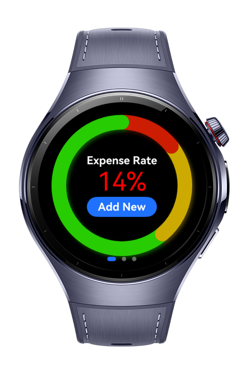

> **Note:** To access all shared projects, get information about environment setup, and view other guides, please visit [Explore-In-HMOS-Wearable Index](https://github.com/Explore-In-HMOS-Wearable/hmos-index).

# Personal Finance Vault

Personal Finance Vault is a fully functional wearable watch application for **HarmonyOS NEXT** wearable devices,
developed using **ArkTS**, that helps users securely track, manage, and analyze their personal finances on the go.

# Preview

<div>



</div>

# Use Cases

1. Quick Expense Logging: Users can instantly record daily expenses such as food, transport, or shopping directly from
   their watch, reducing the chance of forgetting small purchases.
2. Spending Overview at a Glance: With a clean and minimal interface, users can view their daily, weekly, or monthly
   spending summaries right from their wrist.
3. Secure Data Vault: The app provides a safe vault for storing financial data with device-level encryption, ensuring
   privacy and security of sensitive information.
4. Budget Tracking: Users can set budget goals (e.g., monthly savings or category limits) and monitor their progress
   with visual indicators on the watch.
5. Secure Login with Backup & Restore: The vault is protected with secure PIN, and users can safely back up data to the
   device or restore it later.
6. Battery-Friendly Performance: Optimized for HarmonyOS NEXT wearables, the app runs efficiently with minimal battery
   consumption for all-day usage.

# Tech Stack

- **Languages**: ArkTS
- **Frameworks**: HarmonyOS SDK 5.1.0(18)
- **Tools**: DevEco Studio Vers 5.1.0.842
- **Libraries**: @kit.ArkUI, @kit.ArkData

# Directory Structure

```
entry/src/main
    │── module.json5                  // Module configuration for the HarmonyOS app
    │
    └── ets                           // Main ArkTS source directory
        │── Main.ets                  // Application entry file
        │
        ├── core                      // Core utilities & base definitions
        │   ├── constants
        │   │    └── Constants.ets    // Application-wide constant values
        │   │
        │   └── enums
        │        └── OperationType.ets // Enum for different operation categories
        │
        ├── data                      // Data access & persistence layer
        │   ├── keyValueDao
        │   │    └── KeyValueDao.ets  // DAO for key-value storage (user password, backups, etc.)
        │   │
        │   ├── rdbDao
        │   │    └── RDBDao.ets       // DAO for relational database operations (expenses, income, etc.)
        │   │
        │   └── repository
        │        ├── KVRepositoryImpl.ets  // Implementation of KV repository
        │        └── RDBRepositoryImpl.ets // Implementation of RDB repository
        │
        ├── domain                    // Domain/business layer (entities & abstractions)
        │   ├── model
        │   │    └── Operation.ets    // Data model representing a financial operation
        │   │
        │   └── repository
        │        ├── KVRepository.ets  // Repository interface for key-value storage
        │        └── RDBRepository.ets // Repository interface for relational DB
        │
        ├── entryability
        │    └── EntryAbility.ets      // Main app ability (entry point of app)
        │
        ├── entrybackupability
        │    └── EntryBackupAbility.ets // Ability dedicated to backup/restore functionality
        │
        └── features                   // Feature-based modules (separation by functionality)
            ├── add                    // "Add operation" feature
            │   ├── models
            │   │    └── OperationType.ets // Model for defining types of operations (specific to add feature)
            │   │
            │   ├── ui
            │   │    └── InsertOperation.ets // UI page to add a new financial operation
            │   │
            │   └── viewmodel
            │        └── InsertViewModel.ets // ViewModel handling add operation logic
            │
            ├── auth                   // Authentication feature
            │   ├── ui
            │   │    └── AuthPage.ets   // UI for login / create user
            │   │
            │   └── viewmodel
            │        └── AuthViewModel.ets // ViewModel for authentication
            │
            └── dashboard              // Dashboard feature
                ├── ui
                │   ├── DashboardPage.ets // Main dashboard UI page
                │   │
                │   └── components       // UI components used inside Dashboard
                │        ├── LastOperations.ets // Component showing recent operations
                │        ├── PieChart.ets       // Component showing financial distribution
                │        └── Settings.ets       // Component for settings (reset password, backup, restore)
                │
                └── viewmodel
                     └── DashboardViewModel.ets // ViewModel powering dashboard data & logic
```

# Constraints and Restrictions

## Suported Devices

- Huawei Watch 5

## Limitations

- KeyValue Store and RDB is not working on previewer.

# License

**PersonalFinanceVault** is distributed under the terms of the MIT License
See the [license](./LICENSE) for more information.
